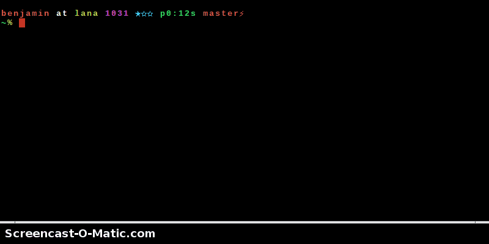

DisPass
******************************************************************************

.. image:: https://badge.waffle.io/babab/DisPass.png?label=ready&title=Ready
 :target: https://waffle.io/babab/DisPass
 :alt: 'Stories in Ready'

DisPass is a password manager for GNU/Linux, \*BSD, MacOS X and Windows.
It can be used as any traditional password manager, but has one key
difference. DisPass does not store your passwords anywhere, so you
can never lose them. It creates strong and unique passphrases formed
from a master password and a label (and some optional parameters),
helping you get rid of the bad habit of using a single password for
multiple websites. Dispass is a console application, but also has a
simple graphical interface.

DisPass has several homes on the Internet:

Main website
   http://dispass.org

The cheeseshop (PyPI) project page
   http://pypi.python.org/pypi/DisPass/

Github repository and Issue tracker
   https://github.com/dispass/dispass/

Bitbucket repository
   https://bitbucket.org/babab/dispass/

Quick start
==============================================================================

These are quick instructions for the impatient, just wanting to check
out DisPass.

DisPass uses reStructuredText and Sphinx for building its documentation.
For full documentation on using *DisPass, the program* or *DisPass, the
python package*, visit http://dispass.org

If you are reading this as a README file on Github or Bitbucket you can try
browsing to `docs/en/02-user-docs.rst`_ to see the rendered user documentation.
Since the development documentation (the code) is compiled by Sphinx' autodoc
extension, you can only find that at the website.

Download
--------

Download DisPass from the Python Package Index with pip. As root, do the
following

.. code:: console

   # pip install dispass

If you don't have pip installed you can try easy_install:

.. code:: console

   # easy_install dispass

If you are using Archlinux, it is advised to `install dispass with pacman`_.

Using DisPass for the first time
--------------------------------

For this example we will set a passphrase to use for a google account.

Create and save a label ``google`` to the labelfile::

    $ dispass add google

Generate the passphrase for the first time. Since you will need to
register the password with google we pass the ``-v`` flag to avoid
typing errors while creating the passphrase for the first time::

    $ dispass generate -v google

Mini screencast
---------------

Checkout the following mini screencast. In this demo the label is added
interactively.

.. _install dispass with pacman: https://aur.archlinux.org/packages.php?K=dispass

Software license
==============================================================================

DisPass is released under an ISC license, which is functionally
equivalent to the simplified BSD and MIT/Expat licenses, with language
that was deemed unnecessary by the Berne convention removed.

::

   Copyright (c) 2012-2016  Tom Willemse <tom@ryuslash.org>
   Copyright (c) 2011-2016  Benjamin Althues <benjamin@althu.es>

   Permission to use, copy, modify, and distribute this software for any
   purpose with or without fee is hereby granted, provided that the above
   copyright notice and this permission notice appear in all copies.

   THE SOFTWARE IS PROVIDED "AS IS" AND THE AUTHOR DISCLAIMS ALL WARRANTIES
   WITH REGARD TO THIS SOFTWARE INCLUDING ALL IMPLIED WARRANTIES OF
   MERCHANTABILITY AND FITNESS. IN NO EVENT SHALL THE AUTHOR BE LIABLE FOR
   ANY SPECIAL, DIRECT, INDIRECT, OR CONSEQUENTIAL DAMAGES OR ANY DAMAGES
   WHATSOEVER RESULTING FROM LOSS OF USE, DATA OR PROFITS, WHETHER IN AN
   ACTION OF CONTRACT, NEGLIGENCE OR OTHER TORTIOUS ACTION, ARISING OUT OF
   OR IN CONNECTION WITH THE USE OR PERFORMANCE OF THIS SOFTWARE.

.. _install dispass with pacman: https://aur.archlinux.org/packages.php?K=dispass
.. _docs/en/02-user-docs.rst: docs/en/02-user-docs.rst
